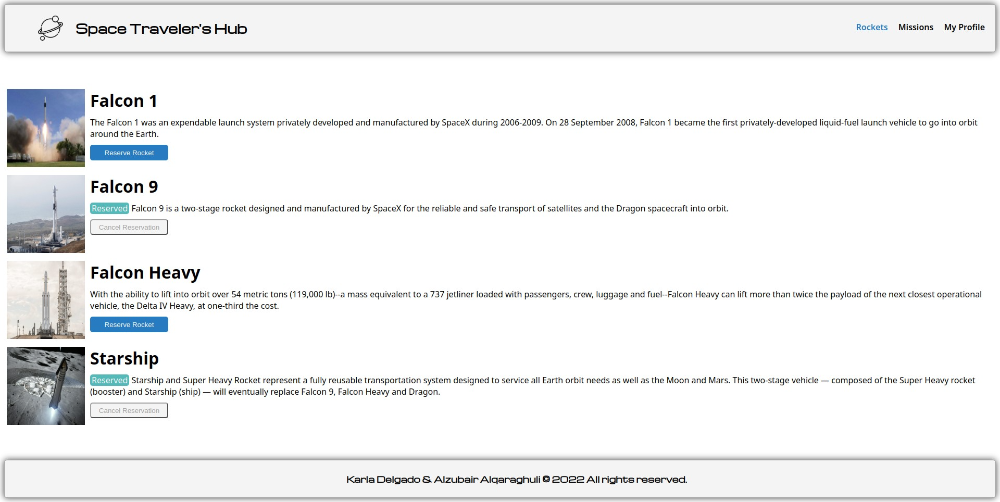
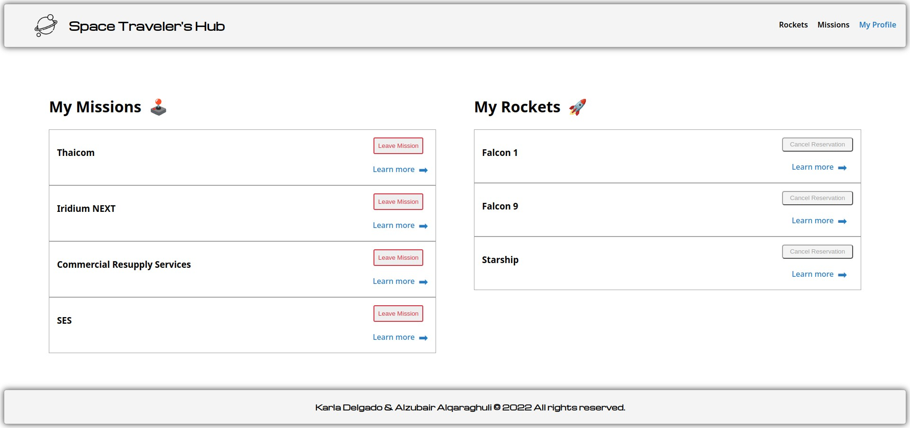

# Space Traveler's Hub :rocket: :astronaut:

> A Website App built with React and Redux for a company that provides commercial and scientific space travel services. The application fetches the data from the SpaceX API and allows users to book rockets and join selected space missions.

## Built With :hammer_and_wrench: 

- **HTML/CSS & JS best practices:** Correct use of tags, elements, properties and syntax.
- **GitHub flow:**  Correct use of Branches for deployment and features development.
- **Linters Check:** Local and Pull Request check for errors, bugs and stylistic errors in code.
- **Webpack:** Bundler form JavaScript files for usage in a browser.
- **Jest:** JS testing framework used for the app testing.
- **REACT JS:** JS library used for the basic structure (components).
- **Redux/Redux Toolkit:** JS library used to handle the app state changes/updates.

## Preview :eye_speech_bubble:

### Main View/Rockets

### Missions View

### My Profile

## Live Demo :arrow_forward:

https://precious-tapioca-7e809f.netlify.app

## Set Up Guide :page_facing_up: 

1. Use the following link for "$ git clone" the [repo](https://github.com/Alzubair98/REACT-GROUP-PROJECT.git) and cd REACT-GROUP-PROJECT

2. "npm install" to install all the dependencies

3. "npm start" to run the live version locally

4. "code ." To open the project on your local editor

5. Please click on the "access link" so you can check the live demo

6. You can use the Space Hub to book rockets :rocket: and join selected space missions :astronaut:

## Authors :writing_hand: :busts_in_silhouette:

:woman_technologist:  **Karla Delgado** :writing_hand: 

- GitHub: [@karlavdelgadof](https://github.com/karlavdelgadof)
- Twitter: [@karlavdelgadof](https://twitter.com/karlavdelgadof)
- LinkedIn: [Karla Delgado](https://www.linkedin.com/in/karla-delgado-613a32239/)

:man_technologist: **Alzubair Alqaraghuli** :writing_hand:

- GitHub: [@Alzubair98](https://github.com/Alzubair98)
- Twitter: [@FitZubair](https://twitter.com/FitZubair)
- LinkedIn: [Alzubair Alqaraghuli](https://www.linkedin.com/in/alzubair-alqaraghuli-272918233/) 

## 🤝 Contributing

Contributions, issues, and feature requests are welcome!

Feel free to check the [issues page](../../issues/).

## Acknowledgments :star2:

- App logo attributed to [Planet icons created by Freepik - Flaticon](https://www.flaticon.com/free-icons/planet)
- [SpaceX API](https://api.spacexdata.com/v3/) for app data.

## Show your support

Give a ⭐️ if you like this project!

## 📝 License

This project is [MIT](./MIT.md) licensed.
